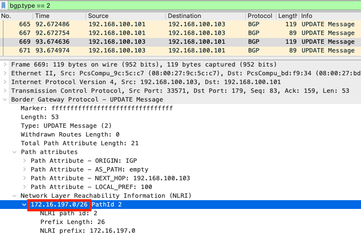
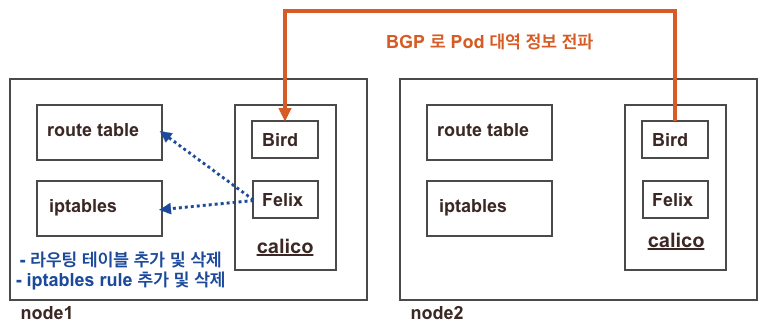

\*개인이 학습 간에 작성한 내용이므로, 잘못된 내용은 댓글/피드백 부탁드립니다.

**수정내역**
\*22.02.06 가시다님 피드백으로 calico network policy에 대해서 간단하게 내용 추가

3주차에 진행했던 calico에 대한 내용 이해에 어려움을 겪은 바..calico의 기본 개념을 정리하고자 함.

## 1. 쿠버네티스 CNI(Container Network Interface)
---
calico에 대해서 이해하기 전에 먼저 CNI가 무엇인지 알아야 할 필요가 있다.
\[[공식문서 - 클러스터 네트워킹](https://kubernetes.io/ko/docs/concepts/cluster-administration/networking/)\]
쿠버네티스 네트워크 환경을 구성해주는 것을 CNI add on이라고 한다. 공식적으로 k8s CNI는 k8s의 core component에 속하지 않기에 add on으로 분류되며, CNI는 컨테이너의 네트워크 문제에만 관여하기 때문에 그 외의 요소에는 별도의 제한이 없다. 때문에 공식 문서만 해도 엄청나게 많은 CNI 3rd-party 프로젝트를 소개하고 있으며 이들 간의 특징이 각각 다르다. CNI는 컨테이너의 netns를 세팅하고, 호스트의 bridge와 컨테이너 사이에 veth를 연결하여 각 네트워크 인터페이스마다 대역에 맞는 IP를 할당하는 작업을 수행한다. 이 내용이 1주차에 수행했던 실습 내용인데, 결국 CNI는 반드시 k8s가 아닌 다른 런타임에서도 동일하게 동작할 수 있다는 이야기가 된다.

*찾아보니 CNI는 애초에 쿠버네티스에 종속된 플러그인이 아니라 CNCF(Cloud Native Computing Foundation) 프로젝트임.

k8s CNI의 공식 명세의 최상단에도 적혀있지만, k8s CNI는 4가지 네트워크 문제를 해결해야 한다.

### 1-1. k8s CNI가 해결해야 하는 4가지 네트워크 문제
\1. 파드<-> 파드 간 NAT 없이 통신 가능해야 한다.
\2. 파드<->서비스 간 통신 가능해야 한다.
\3. 외부<->서비스 간 통신 가능해야 한다.
\4.  파드 내 여러 컨테이너가 동작 시, pause 컨테이너의 netns를 공유하여 컨테이너간 통신이 localhost로 가능해야 한다.

이러한 문제를 해결함으로써, CNI에 의한 k8s 클러스터의 네트워크는 다음과 같은 기준 하에 동작해야 한다.

### 1-2. k8s 네트워크의 동작 기준
\1. 노드가 달라도 Pod to Pod간 NAT없이 통신 가능해야 한다.
\2. 노드의 에이전트(system daemons, kubelet)는 해당 노드의 모든 파드와 통신 가능해야 한다.
\3. 노드의 host network에 있는 파드는 NAT 없이 모든 노드의 파드와 통신 가능해야 한다.
\4. 서비스 클러스터 IP 대역은 각 노드에 할당된 파드의 IP 대역과 겹치지 않아야 한다.(IPAM에 의해 제어됨)


## 2. Calico Component
---

공식 문서에서 확인할 수 있는 calico component의 architecture이다. 먼저 calico를 구성하는 요소들을 살펴보고자 한다.
마스터노드를 포함한 각 노드에 데몬셋으로 calico-node 파드가 배치되어 felix, bird, confd 등이 동작하며, calico controller파드는 deployment로 배치된다.

- Felix : 각 노드에 할당된  pod의 IP 대역이 BGP로 전파되면 그 대역과 정상적으로 통신이 이루어질 수 있도록 iptables와 라우팅테이블 등을 조정한다.
- BIRD : Bird는 오픈소스 라우팅 데몬 프로그램이다. calico pod 안 에서 프로세스로 동작하며 각 노드의 pod 정보를 BIRD가 전파하고, 전파 받는다.

노드마다 Bird가 있고, wireshark로  확인해보면 172.16.197.0/26이 현재 Bird가 있는 노드의 pod 대역이라고 광고하는 것. 그럼 상대방 노드의 Bird는 저 노드랑 통신하기 위해 route table에 추가함.

- Datastore plugin: calico에서 사용되는 여러가지 정보들이 업데이트 된다. 예전에는 etcd를 썼는데 최근에는 k8s api datastore(kdd)에 많이 저장함. 굳이 민감한 저장소를 사용할 필요 없이 경량의 가벼운 저장소를 사용하는 추세.
- 
- Confd : 경량의 configuration management 를 위한 오픈소스로 툴로, datastore를 모니터링 하고 있다가 BGP 설정이나 IPAM 정보 등이 변경되면 변경된 값이 반영될 수 있도록 트리거하는 역할을 한다. 

- Calico IPAM plugin : 각 노드별로 사용할 pod의 대역을 직접 엔지니어가 설정하고, 대역이 모자르는 등의 상황이 발생하면 매우 골치아픈 상황이 발생할 수 있다. calico는 자체 IP관리 기능인 IPAM을 제공함으로써 파드에 할당될 대역을 적절하게 지정해주는 역할을 한다.


*BGP?
스위치나 라우터 등의 네트워크 장비에서 통신하기 위한 상대의 ip 대역을 전파하기 위해 사용되는 프로토콜. Calico에서 BGP로 대역을 전파한다는 것은 네트워크 팀에서 다루는 물리적인 라우터 장비하고도 연결 가능하다는 의미임. 2주차에 학습했던 Flannel CNI에서는 자기들끼리만 vxlan으로 연결하기 떄문에 이런게 불가능했음.


출처 : 가시다님 노션

이렇게 전달받은 정보를 리눅스 라우팅 테이블에 추가하는 것은 Felix가 수행하고, 상대방 노드의 pod 대역을 BGP프로토콜로 bird를 통해 전달받아서 라우팅 테이블과  iptable 룰을 조정한다.
configd는 datastore로 지정된 저장소를 모니터링하고 있다가 값의 변경이 발생하면 트리거 발생시켜서 적용될 수 있도록 한다. 
이러한 과정을 거쳐 각 노드에는 pod의 ip 대역으로 사용할 대역이 IPAM에 의해 정해진다.

## Q. calico IPAM도 있고, k8s 클러스터 구성되면 기본적으로 host local IPAM도 동작한다. 그럼 둘 중에 어느게 기준이 되고, 어떻게 동작할까?
---

```bash
# IPAM 정보 확인
(calico-k8s:default) root@k8s-m:~# calicoctl ipam show
| GROUPING |     CIDR      | IPS TOTAL | IPS IN USE |   IPS FREE   |
+----------+---------------+-----------+------------+--------------+
| IP Pool  | 172.16.0.0/16 |     65536 | 7 (0%)     | 65529 (100%) |
+----------+---------------+-----------+------------+--------------+


# IP Pool은 클러스터 전체를 기준으로, Block은 각 노드에 할당된 podCIDR 정보
(calico-k8s:default) root@k8s-m:~# calicoctl ipam show --show-blocks
+----------+-----------------+-----------+------------+--------------+
| GROUPING |      CIDR       | IPS TOTAL | IPS IN USE |   IPS FREE   |
+----------+-----------------+-----------+------------+--------------+
| IP Pool  | 172.16.0.0/16   |     65536 | 7 (0%)     | 65529 (100%) |
| Block    | 172.16.116.0/24 |       256 | 4 (2%)     | 252 (98%)    |
| Block    | 172.16.158.0/24 |       256 | 1 (0%)     | 255 (100%)   |
| Block    | 172.16.184.0/24 |       256 | 1 (0%)     | 255 (100%)   |
| Block    | 172.16.34.0/24  |       256 | 1 (0%)     | 255 (100%)   |
+----------+-----------------+-----------+------------+--------------+
```

```bash
(calico-k8s:default) root@k8s-m:~# kubectl get nodes -o jsonpath='{.items[*].spec.podCIDR}' ;echo
172.16.0.0/24 172.16.1.0/24 172.16.2.0/24 172.16.3.0/24

(calico-k8s:default) root@k8s-m:~# kubectl get node k8s-m -o json | jq '.spec.podCIDR'
"172.16.0.0/24"
```
워커 노드마다 할당된 ip 대역을 확인해보면, host local ipam은 172.16.0.0/24, 1.0/24, 2.0/24, 3.0/24 를 할당하고 있다.
그러나 위에서 calicoctl로 확인했을 때는 172.16.116.0/24, 158.0/24, 134.0/24, 34.0/24로 대역이 전혀 다르다.
이들 중 어느 쪽이 우선순위를 가지고 적용되는지에 대한 근거를 아래와 같은 방법으로 확인할 수 있다.
 
```bash
(calico-k8s:default) root@k8s-m:~# tree /etc/cni/net.d
/etc/cni/net.d
├── 10-calico.conflist
└── calico-kubeconfig

0 directories, 2 files
(calico-k8s:default) root@k8s-m:~# cat /etc/cni/net.d/10-calico.conflist
{
  "name": "k8s-pod-network",
  "cniVersion": "0.3.1",
  "plugins": [
    {
      "type": "calico",
      "log_level": "info",
      "log_file_path": "/var/log/calico/cni/cni.log",
      "datastore_type": "kubernetes",
      "nodename": "k8s-m",
      "mtu": 0,
      "ipam": {
          "type": "calico-ipam"
      },
      "policy": {
          "type": "k8s"
      },
      "kubernetes": {
          "kubeconfig": "/etc/cni/net.d/calico-kubeconfig"
      }
    },
    {
      "type": "portmap",
      "snat": true,
      "capabilities": {"portMappings": true}
    },
    {
      "type": "bandwidth",
      "capabilities": {"bandwidth": true}
    }
  ]
}
```

CNI Plugin 관련 정보를 확인할 수 있는 디렉토리에서 설정된 내용을 확인해보면 (/etc/cni/net.d/10-calico.conflist) IPAM 옵션의 값이 calico-ipam으로 되어있다. 
이 설정에 의해 cni의 ipam이 우선된다.

*전 주에 학습했던 flannel은 ipam을 지원하는 별도의 플러그인을 포함하고 있지 않으므로, host local ipam을 그대로 사용한다.

칼리코의 네트워크 모드 정보 확인
```bash
(calico-k8s:default) root@k8s-m:~#  calicoctl get ippool -o wide
NAME                  CIDR            NAT    IPIPMODE   VXLANMODE   DISABLED   DISABLEBGPEXPORT   SELECTOR
default-ipv4-ippool   172.16.0.0/16   true   Always     Never       false      false              all()
```

calico가 가지고 있는 컴포넌트 동작 확인
```bash
ps axf
...
   8288 ?        Sl     0:06 /usr/bin/containerd-shim-runc-v2 -namespace moby -id 73ca5a07ab48998e0af492ce22a359d101fed2
   8316 ?        Ss     0:00  \_ /usr/local/bin/runsvdir -P /etc/service/enabled
   8426 ?        Ss     0:00      \_ runsv monitor-addresses
   8441 ?        Sl     0:00      |   \_ calico-node -monitor-addresses
   8427 ?        Ss     0:00      \_ runsv node-status-reporter
   8434 ?        Sl     0:00      |   \_ calico-node -status-reporter
   8428 ?        Ss     0:00      \_ runsv confd
   8439 ?        Sl     0:00      |   \_ calico-node -confd
   8429 ?        Ss     0:00      \_ runsv allocate-tunnel-addrs
   8438 ?        Sl     0:00      |   \_ calico-node -allocate-tunnel-addrs
   8430 ?        Ss     0:00      \_ runsv bird
   8639 ?        S      0:01      |   \_ bird -R -s /var/run/calico/bird.ctl -d -c /etc/calico/confd/config/bird.cfg
   8431 ?        Ss     0:00      \_ runsv bird6
   8638 ?        S      0:00      |   \_ bird6 -R -s /var/run/calico/bird6.ctl -d -c /etc/calico/confd/config/bird6.cfg
   8432 ?        Ss     0:00      \_ runsv cni
   8445 ?        Sl     0:00      |   \_ calico-node -monitor-token
   8433 ?        Ss     0:00      \_ runsv felix
   8442 ?        Sl     0:59          \_ calico-node -felix
...
```

felix가 변경한 iptables 룰 확인
```bash
root@k8s-w0:~# iptables -t filter -S | grep cali
-N cali-FORWARD
-N cali-INPUT
-N cali-OUTPUT
-N cali-cidr-block
-N cali-from-hep-forward
-N cali-from-host-endpoint
-N cali-from-wl-dispatch
-N cali-to-hep-forward
-N cali-to-host-endpoint
-N cali-to-wl-dispatch
-N cali-wl-to-host
-A INPUT -m comment --comment "cali:Cz_u1IQiXIMmKD4c" -j cali-INPUT
-A FORWARD -m comment --comment "cali:wUHhoiAYhphO9Mso" -j cali-FORWARD
-A FORWARD -m comment --comment "cali:S93hcgKJrXEqnTfs" -m comment --comment "Policy explicitly accepted packet." -m mark --mark 0x10000/0x10000 -j ACCEPT
-A FORWARD -m comment --comment "cali:mp77cMpurHhyjLrM" -j MARK --set-xmark 0x10000/0x10000
-A OUTPUT -m comment --comment "cali:tVnHkvAo15HuiPy0" -j cali-OUTPUT
-A cali-FORWARD -m comment --comment "cali:vjrMJCRpqwy5oRoX" -j MARK --set-xmark 0x0/0xe0000
-A cali-FORWARD -m comment --comment "cali:A_sPAO0mcxbT9mOV" -m mark --mark 0x0/0x10000 -j cali-from-hep-forward
-A cali-FORWARD -i cali+ -m comment --comment "cali:8ZoYfO5HKXWbB3pk" -j cali-from-wl-dispatch
-A cali-FORWARD -o cali+ -m comment --comment "cali:jdEuaPBe14V2hutn" -j cali-to-wl-dispatch
-A cali-FORWARD -m comment --comment "cali:12bc6HljsMKsmfr-" -j cali-to-hep-forward
-A cali-FORWARD -m comment --comment "cali:NOSxoaGx8OIstr1z" -j cali-cidr-block
-A cali-INPUT -p ipencap -m comment --comment "cali:PajejrV4aFdkZojI" -m comment --comment "Allow IPIP packets from Calico hosts" -m set --match-set cali40all-hosts-net src -m addrtype --dst-type LOCAL -j ACCEPT
-A cali-INPUT -p ipencap -m comment --comment "cali:_wjq-Yrma8Ly1Svo" -m comment --comment "Drop IPIP packets from non-Calico hosts" -j DROP
-A cali-INPUT -i cali+ -m comment --comment "cali:8TZGxLWh_Eiz66wc" -g cali-wl-to-host
-A cali-INPUT -m comment --comment "cali:6McIeIDvPdL6PE1T" -m mark --mark 0x10000/0x10000 -j ACCEPT
-A cali-INPUT -m comment --comment "cali:YGPbrUms7NId8xVa" -j MARK --set-xmark 0x0/0xf0000
-A cali-INPUT -m comment --comment "cali:2gmY7Bg2i0i84Wk_" -j cali-from-host-endpoint
-A cali-INPUT -m comment --comment "cali:q-Vz2ZT9iGE331LL" -m comment --comment "Host endpoint policy accepted packet." -m mark --mark 0x10000/0x10000 -j ACCEPT
-A cali-OUTPUT -m comment --comment "cali:Mq1_rAdXXH3YkrzW" -m mark --mark 0x10000/0x10000 -j ACCEPT
-A cali-OUTPUT -o cali+ -m comment --comment "cali:69FkRTJDvD5Vu6Vl" -j RETURN
-A cali-OUTPUT -p ipencap -m comment --comment "cali:AnEsmO6bDZbQntWW" -m comment --comment "Allow IPIP packets to other Calico hosts" -m set --match-set cali40all-hosts-net dst -m addrtype --src-type LOCAL -j ACCEPT
-A cali-OUTPUT -m comment --comment "cali:9e9Uf3GU5tX--Lxy" -j MARK --set-xmark 0x0/0xf0000
-A cali-OUTPUT -m comment --comment "cali:0f3LDz_VKuHFaA2K" -m conntrack ! --ctstate DNAT -j cali-to-host-endpoint
-A cali-OUTPUT -m comment --comment "cali:OgU2f8BVEAZ_fwkq" -m comment --comment "Host endpoint policy accepted packet." -m mark --mark 0x10000/0x10000 -j ACCEPT
-A cali-from-wl-dispatch -m comment --comment "cali:zTj6P0TIgYvgz-md" -m comment --comment "Unknown interface" -j DROP
-A cali-to-wl-dispatch -m comment --comment "cali:7KNphB1nNHw80nIO" -m comment --comment "Unknown interface" -j DROP
-A cali-wl-to-host -m comment --comment "cali:Ee9Sbo10IpVujdIY" -j cali-from-wl-dispatch
-A cali-wl-to-host -m comment --comment "cali:nSZbcOoG1xPONxb8" -m comment --comment "Configured DefaultEndpointToHostAction" -j ACCEPT
```

nat 테이블 확인
```bash
iptables -t nat -S | grep cali
```

도커 네트워킹에서는 동일 노드 내에서 컨테이너가 bridge를 두고 통신을 했었는데, calico는 파드와 파드 사이에 어떻게 통신할까?

결론적으로는 유사한 부분이 있다. host에는 veth로 연결된 calice라는 인터페이스가 생성되어서 바로 통신 가능하며, 이 때 host net ns를 거치기 때문에 host에서는 iptables의 forwarding rule에 허용이 되어있어야 함.

*proxy arp
169.254.1.1을 GW IP로 지정하고 이에 대한 MAC을 응답하려면 proxy arp가 활성화 되어있어야 함.

```bash
(calico-k8s:default) root@k8s-m:~# calicoctl get ippool -o wide
NAME                  CIDR            NAT    IPIPMODE   VXLANMODE   DISABLED   DISABLEBGPEXPORT   SELECTOR
default-ipv4-ippool   172.16.0.0/16   true   Always     Never       false      false              all(
```

NAT가 true -> 호스트에서 masquerading 하도록 되어있다
보안상 network 팀이 관리하는 방화벽 쪽으로 보내서 외부와 통신하도록 할 수도 있음. 보안상 외부와 통신하면 안되는 pod를 구분해서 관리하는 용도로도 사용 가능.


서로 다른 노드의 파드 통신의 경우
tunl(tunnel) 인터페이스를 통해 빠져나가면서 overlay 헤더가 추가되어 상대 노드 tunl에 도착하면 outer 헤더를 벗겨내고 실제 pod의 네트워크 대역 정보로 통신이 이루어짐

OuterIP 프로토콜(IPIP vs vxlan)
vxlan이 오버헤드가 더 큼
azure는 IPIP헤더 불가능. calico의 IPIP 모드 사용 안 됨.
aws는 ip 프로토콜 4번을 허용해주면 IPIP 터널 트래픽이 통과 가능.
kt gcloud도 안됨.


## 3. Calico Mode
---
### 3-1. IPIP
원본 패킷이 상대 노드의 파드와 통신할 때 outer 패킷(IPIP overlay)을 사용해서 통신

### 3-2. Direct
성능은 20%정도 IPIP보다 뛰어남. overlay 없이 파드의 패킷이 그대로 상대 노드에 전달됨
모니터링 할 때 Pod IP도 직접 보임
환경만 가능하다면 Direct 모드를 쓰는게 성능, 관리면에서 좋음

단, AWS에서 Direct 모드를 이용시 Source/Destination Check 기능을 Disable 해야 함
eni의 MAC이 아닌 pod 내부의 네트워크 인터페이스의 MAC이 통과할 수 있도록 

virtual box의 경우 무작위모드를 모두 허용 하면 됨

## 3-3. CrossSubnet
같은 네트워크 대역의 노드는 Direct 모드로, 다른 대역의 노드는 IPIP 모드로 동작하도록 함


### 3-4. VXLAN
Outer가 VXLAN 임
단, Calico 에서 VXLAN 사용하면 BGP 불가능
Calico에서 BGP를 사용한다고 하면 IPIP 또는 Direct를 사용해야 network 팀 장비와 BGP 연동이 가능함.
VXLAN은 BGP를 반드시 disable 해야 함

### 3-5. Pod 패킷 암호화
어플리케이션 레벨이 아닌 보안적, 법적인 규제 때문에 서로 다른 노드의 파드가 통신할 때 network 레벨의 암호화가 필요한 경우가 있음
wireg 기능을 쓰면 통신 트래픽이 암호화되어 상대방 노드와 통신 가능해짐

## 4. Calico Network Policy
---
### 4-1. 개요
[공식 문서 - Calico Network policy](https://projectcalico.docs.tigera.io/security/calico-network-policy)

k8s는 L3,L4의 네트워크 트래픽 제어를 network policy 라는 k8s 오브젝트를 정의함으로써 수행하며, cni를 이용하여 k8s네트워크를 구성한 경우 network policy를 제공하는 네트워크 플러그인을 사용해야 한다.
(*aws vpc cni의 경우 np를 지원하지 않아 한참 삽질했었음..EKS 사용시에 network policy를 적용하려면 Calico, Cilium 등을 사용해야 함)

기본적으로 k8s의 network policy는 pod레벨의 트래픽 제어를 수행하지만, Calico의 network policy를 사용하면 보다 광범위한 대상에 세밀한 rule을 적용할 수 있다.(vm이나, host interface까지..)
또한 istio등을 이용하여 service mesh를 구성하는 경우에도 calico의 network policy는 보다 안전한 통신을 할 수 있도록 지원한다.
(이 부분은 istio와 연계학습 후 포스팅하기로..)

### 4-2. Calico network policy 지원 범위
- 적용 가능한 endpoint : 파드, 컨테이너, 가상머신, 호스트 인터페이스
- ingress, egress를 각각 정의하며 둘다 정의할 수도 있음
- Action : allow, deny, pass, log(syslog에 connection log를 남김)
- Source and destination match criteria:
		Ports: numbered, ports in a range, and Kubernetes named ports
		Protocols: TCP, UDP, ICMP, SCTP, UDPlite, ICMPv6, protocol numbers (1-255)
		HTTP attributes (if using Istio service mesh)
		ICMP attributes
		IP version (IPv4, IPv6)
		IP or CIDR
		Endpoint selectors (using label expression to select pods, VMs, host interfaces, and/or network sets)
		Namespace selectors
		Service account selectors


### 4-3. Calico Endpoints
calico는 두 가지 유형의 endpoint를 구분하여 network policy를 적용한다.
- workload endpoint : k8s pod, openstack vm이 해당
- host endpoint : 호스트의 네트워크 인터페이스

namespaced network policy로 사용하는 경우 특정 네임스페이스의 파드에 np가 적용되도록 이를 명시해야 한다. workload endpoint에만 적용된다고 볼 수 있음.
global network policy로 정의하는 경우 non-namespaced resource이므로 workload endpoint, host endpoint에 구분없이 적용 가능함.

```yaml
apiVersion: projectcalico.org/v3
kind: NetworkPolicy
metadata:
  name: allow-tcp-6379
  namespace: production
```

```yaml
apiVersion: projectcalico.org/v3
kind: GlobalNetworkPolicy
metadata:
  name: allow-tcp-port-6379
```

위와 같이 GlobalNetworkPolicy의 yaml파일을 정의할 때는 namespace가 들어가지 않는다.
이 때 주의할 점은, GlobalNetworkPolicy는 NetworkPolicy와 구분되는 별개의 kind로 정의되었기 때문에 calicoctl로 정의할 때도 오브젝트 kind를 맞춰주어야 한다.

```bash
calicoctl get networkpolicy
calicoctl get globalnetworkpolicy
```

### 4-4. ingress & egress
하나의 network policy에는 ingress와 egress가 각각 정의될 수 있다.

### 4-5. Behavior
- pod에 network policy가 정의되지 않으면 default로 모든 source에 대하여 모든 트래픽을 허용한다.
- ingress 규칙이 정의된 network policy가 하나라도 pod에 적용된 경우, 명시적으로 허용된 ingress 트래픽만을 허용한다.
- egress도 마찬가지로, 하나라도 적용되는 경우 명시적으로 허용된 egress 트래픽만 통과할 수 있다.

## 5. 실습
---
간단한 데모를 통해 calico network policy를 테스트해보고자 한다.

### 5-1. 통신 확인
```bash
kubectl create ns advanced-policy-demo
kubectl create deployment --namespace=advanced-policy-demo nginx --image=nginx
kubectl expose --namespace=advanced-policy-demo deployment nginx --port=80
```

advanced-policy-demo 라는 이름으로 네임스페이스를 만들고 80번 포트를 사용하는 nginx deployment를 생성한다.

```bash
kubectl run --namespace=advanced-policy-demo access --rm -ti --image busybox /bin/sh
```

이와는 별개로 busybox 파드를 동일 네임스페이스에 생성하고 쉘에 접근하면 아래와 같이 연결된다.

```bash
Waiting for pod advanced-policy-demo/access-472357175-y0m47 to be running, status is Pending, pod ready: false

If you don't see a command prompt, try pressing enter.
/ #
```

```bash
wget -q --timeout=5 nginx -O -
wget -q --timeout=5 google.com -O -
```

busybox 파드 내부의 쉘에 연결되면 nginx와 google.com에 대한 접근을 테스트해서 html 응답이 떨어지면 된다.

### 5-2. 모든 트래픽 차단(global network policy)
non-namespaced resource인 GlobalNetworkPolicy를 사용하여 selector와 일치하는 모든 파드에 network policy를 적용한다. 기존 k8s network policy를 이용하는 경우 네임스페이스별로 deny 정책을 만들어서 적용해주어야 한다. 단, 본 예시에서는 kube-system 네임스페이스의 파드는 GlobalNetworkPolicy의 영향을 받지 않도록 제외한다.

\*실제 운영환경에서는 k8s 클러스터의 동작에 영향을 주지 않도록 GlobalNetworkPolicy 적용 전에 반드시 검토가 필요할 듯 함.

```bash
$ calicoctl create -f - <<EOF
apiVersion: projectcalico.org/v3
kind: GlobalNetworkPolicy
metadata:
  name: default-deny
spec:
  selector: projectcalico.org/namespace != "kube-system"
  types:
  - Ingress
  - Egress
EOF
```

kube-system 네임스페이스를 제외한 모든 네임스페이스에서 모든 ingress, egress 트래픽이 deny 되었고, 통신을 원하는 대역의 경우 명시적으로 allow해야 한다.

앞서 통신을 테스트 했던 방법과 동일하게 테스트를 수행하면 정상적으로 통신이 이루어지지 않음을 확인할 수 있다.

```bash
#busybox 파드 쉘에서 수행
wget -q --timeout=5 nginx -O -
wget -q --timeout=5 google.com -O -
```

응답은 아래와 같다.
```bash
/ # wget -q --timeout=5 nginx -O -
wget: bad address 'nginx'

/ # wget -q --timeout=5 google.com -O -
wget: bad address 'google.com'
```

### 5-3. 모든 egress 트래픽 허용

```bash
$ calicoctl create -f - <<EOF
apiVersion: projectcalico.org/v3
kind: NetworkPolicy
metadata:
  name: allow-busybox-egress
  namespace: advanced-policy-demo
spec:
  selector: run == 'access'
  types:
  - Egress
  egress:
  - action: Allow
EOF
```

busybox에서 모든 아웃바운드 트래픽을 명시적으로 허용한다. 동일하게 통신을 테스트 하면 google.com으로부터 HTML 응답이 돌아옴을 확인할 수 있다.

그러나 여전히 nginx 로부터는 응답을 받지 못하고 있다. 왜일까?

### 5-4.  nginx에 대한 인그레스 트래픽 허용
busybox 파드에서 나가는 아웃바운드 트래픽은 허용이 되었으나, 앞서 적용된 nginx 파드의 ingress 거부 정책이 아직 유효하기 때문이다.

```bash
$ calicoctl create -f - <<EOF
apiVersion: projectcalico.org/v3
kind: NetworkPolicy
metadata:
  name: allow-nginx-ingress
  namespace: advanced-policy-demo
spec:
  selector: app == 'nginx'
  types:
  - Ingress
  ingress:
  - action: Allow
    source:
      selector: run == 'access'
EOF
```

nginx 파드의 network policy에서 selector: run == 'access' 조건을 만족하는 source로부터의 ingress 트래픽을 허용하도록 하고, 다시 테스트 수행.

```bash
/ # wget -q --timeout=5 nginx -O -
<!DOCTYPE html>
<html>
<head>
<title>Welcome to nginx!</title>
<style>
html { color-scheme: light dark; }
body { width: 35em; margin: 0 auto;
font-family: Tahoma, Verdana, Arial, sans-serif; }
</style>
</head>
<body>
<h1>Welcome to nginx!</h1>
<p>If you see this page, the nginx web server is successfully installed and
working. Further configuration is required.</p>

<p>For online documentation and support please refer to
<a href="http://nginx.org/">nginx.org</a>.<br/>
Commercial support is available at
<a href="http://nginx.com/">nginx.com</a>.</p>

<p><em>Thank you for using nginx.</em></p>
</body>
</html>
```

nginx로부터 정상 응답이 돌아옴을 확인할 수 있다.