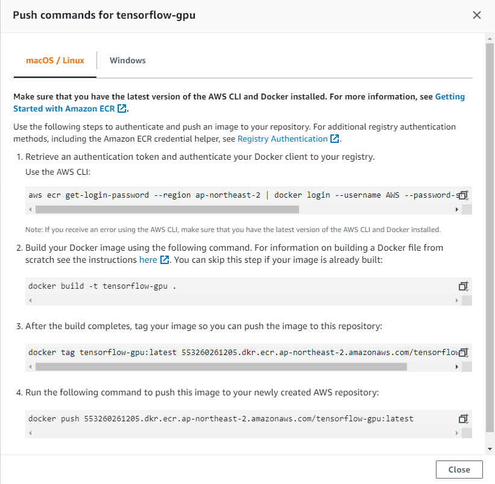

# [AWS] ECS(1) - CPU Units(vCPU) limit 테스트

# 미리 참고하면 좋은 문서들..

---

[https://ecs-cats-dogs.workshop.aws/ko/](https://ecs-cats-dogs.workshop.aws/ko/)

[https://docs.aws.amazon.com/AmazonECR/latest/userguide/what-is-ecr.html](https://docs.aws.amazon.com/AmazonECR/latest/userguide/what-is-ecr.html)

[https://docs.aws.amazon.com/ko_kr/AmazonECS/latest/developerguide/Welcome.html](https://docs.aws.amazon.com/ko_kr/AmazonECS/latest/developerguide/Welcome.html)

*이 글에서는 ECS의 TASK와 컨테이너에 리소스가 할당되고 사용되는 방식에 대한 내용을 다룹니다. AWS ECR, ECS에 대해서는 글의 이해를 돕기 위한 최소한의 개념만 다룹니다.

# ECR이란?

---

ECS에서 docker 환경을 빠르게 구성해주기는 하지만, 컨테이너가 실행될 기반이 되는 이미지가 필요합니다. 또한 이들 이미지가 저장될 이미지 저장소가 필요하죠. ECS 사용을 위해 별도로 이미지 저장소를 구성할 필요 없이 AWS에서는 ECR(Elastic Conatiner Registry)을 통해서 이미지 저장소를 제공합니다.



이미지 레지스트리를 생성하면 이미지를 업로드 할 수 있는 docker 커맨드를 제공합니다. EC2를 이용하여 ECS 클러스터를 생성하였다면 인스턴스에서 위의 커맨드를 입력하여 이미지 빌드 및 업로드가 가능합니다.

# ECS란?

---

ECS를 사용하면 컨테이너를 실행하기 위해 서버를 구성하고 docker를 설치하지 않고도 손쉽게 docker가 구성된 가상환경을 확보할 수 있으며, 확장성과 속도가 뛰어난 컨테이너 관리 서비스입니다. Fargate와 EC2 두 가지 형태로 지원하는데, 이번 글에서는 사용자가 보다 세밀하게 조작 가능한 EC2 기반의 ECS에 대하여 알아보고자 합니다.

# ECS 컴포넌트

---


## 클러스터


ECS 클러스터는 작업과 서비스가 존재하는 논리적 공간입니다. 클러스터가 생성되면 지정한 타입의 EC2 인스턴스가 컨테이너 인스턴스로서 실행되어 Task Definition에 의해 서비스 단위로 컨테이너가 올라올 수 있는 환경이 마련됩니다.

## 작업 정의(Task Definition)

컨테이너를 찍어내는 주물 틀과 같습니다. Task Definition에서 정의한 대로 컨테이너가 찍혀 생성되고, 관련된 컨테이너들은 하나의 서비스에 묶여 속하게 됩니다. Task Definition에서는 각 Task가 얼만큼의 리소스를 확보하고, 확보한 리소스를 컨테이너별로 얼마나 사용할지, 컨테이너와 호스트의 포트 포워딩은 어떻게 할 것인지, 환경변수, 로그 처리 방안, GPU 사용여부 등의 내용을 정의할 수 있습니다. 물론 리소스가 허락하는 선에서 A컨테이너와 B컨테이너를 동시에 찍어내는 Task Definition을 정의할 수도 있습니다.

## 서비스

서비스는 지정된 수의 Task 수를 유지하도록 관리합니다. 서비스 생성 시 Task definition을 이용하여 몇 개의 Task를 찍어낼 것인지 명시할 수 있으며, 각 Task는 컨테이너 인스턴스로 등록된 EC2에 적절히 분배할 수 있습니다. (완전한 균형을 위해서는 별도의 re-balancing이 필요한데, 이는 다음 글에서 다루겠습니다.)

# 컨테이너 인스턴스와 컨테이너 에이전트

---

## 컨테이너 인스턴스

ECS 클러스터 생성시 함께 생성되며, 서비스에 의해 Task가 배치될 EC2 인스턴스를 컨테이너 인스턴스로 지칭합니다.

## 컨테이너 에이전트

컨테이너 인스턴스에서는 별도 에이전트가 동작하면서 현재 인스턴스의 docker container 상태를 AWS ECS로 전송합니다. 컨테이너 인스턴스는 내부의 agent가 동작하면서 ECS를 호출할 수 있는 Role을 부여받아야 하며, 이를 기반으로 ECS에서는 컨테이너의 Status를 확인하고 관리할 수 있게 됩니다.

# 리소스 관리

---

## Task 리소스 관리

- ECS Task definition에서는 할당받은 vCPU를 Units 단위로 나누어 사용합니다. 1024 Units = 1vCPU로 계산하며, 최솟값은 128 Units입니다.
- Task의 vCPU는 10이상 할당할 수 없습니다. 즉, 10240 Units 이상 할당 불가능하며, 값을 입력하지 않으면 컨테이너 인스턴스(host)의 최대 자원을 활용할 수 있습니다.
- 컨테이너 인스턴스에 할당된 리소스보다 많은 CPU/MEM을 Task Definition에 정의할 경우 Task가 정상 실행되지 않습니다.
- Task memory값이 지정된 경우 Task 내 모든 컨테이너에 예약된 총 메모리 양은 Task에 지정된 값 보다 작아야 합니다
- Task에 정의된 리소스 제한은 Hard limit입니다.

## 컨테이너 리소스 관리

- Docker 데몬은 컨테이너에 대해 최소 4MiB의 메모리를 예약하므로 컨테이너에 대해 4MiB 미만의 메모리를 지정해서는 안 됩니다.
- 컨테이너 인스턴스의 EC2 유형에 할당된 숫자의 GPU를 사용하도록 지정할 수 있으며, 모든 컨테이너에서 사용된 GPU의 총 합은 컨테이너 인스턴스에 할당된 GPU 수를 초과할 수 없습니다.
- 기본적으로 모든 컨테이너는 CPU 점유 시간을 동일하게 부여받습니다. 가중치를 조정하면 한 컨테이너의 작업이 유휴 상태일 때 다른 컨테이너 남은 CPU시간을 활용할 수 있습니다.

# 테스트

---


TASK definition에서 container 당 10vCPU까지밖에 할당할 수 없다고 하는데, 실제로 그러한지 확인해보겠습니다. 테스트 방법은 다음과 같습니다.

- CPU limit 해제하고 컨테이너 실행해서 stress 테스트
- vCPU 10(10240Units) 할당하고 컨테이너 실행해서 stress 테스트
- 컨테이너 인스턴스(host)에서 docker stats으로 CPU 사용률 모니터링
- 동시에 컨테이너 내부에서 core가 10개 도는지, 16개 도는지 확인

```bash
#테스트용 Dockerfile
FROM centos:latest
CMD tail -f /dev/null
```


EC2 유형으로는 다른 테스트 목적으로 활용중이던 g4dn.12xlarge 타입을 재활용 했습니다. 반드시 이 유형을 사용할 필요는 없습니다.

Task definition에서 CPU Units을 10240으로 제한하였을 때


컨테이너가 인식하는 코어 수 확인


모든 코어(48개) 사용


컨테이너 내부적으로는 모든 코어를 사용하는 것으로 인식하나, 실제 호스트에는 10vCPU의 제한이 걸려있으므로 CPU 사용률이 1000%까지만 찍힙니다.


이번엔 코어를 절반인 24개만 사용하겠습니다.


이 역시 10vCPU를 넘어서기 때문에 호스트에서는 1000%가 최대 사용률입니다.


12 core를 사용해도 마찬가지입니다.


10vCPU보다 적은 6개 코어 사용하는 경우는?


호스트의 6개 코어가 동작해서 600%가 찍힘을 확인할 수 있습니다.


10개 코어를 모두 사용하는경우


마찬가지로 1000%가 찍힙니다.

CPU Units에 아무 값도 입력하지 않았을 때(최대 할당)


신기하게도 48개 코어는 4800%, 24개 코어는 2400%가 찍힙니다. AWS 공식 문서에서는 10vCPU(10240 Units)가 최대 값으로 설명되어 있는데, 실제로 테스트 해 본 결과 아무 값도 입력하지 않으면 컨테이너 인스턴스(host)가 가진 모든 자원을 활용할 수 있었습니다.

# 결론

---


Task Definition의 CPU Units는 초과 가능하다.

다음 글에서는 메모리 제한에 대해서 동일한 테스트를 진행하고 ,결과를 공유해보겠습니다.